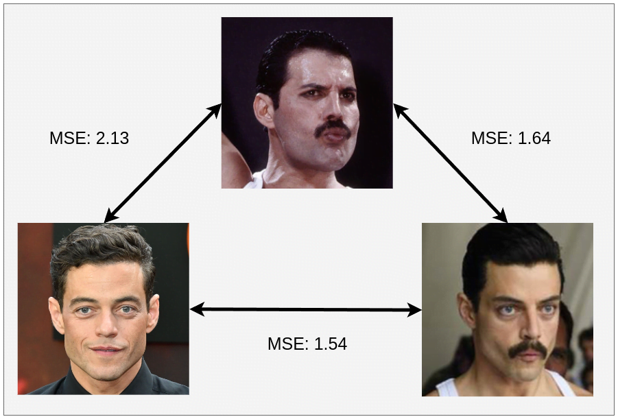

# Identity Similarity

This repository can helps researchers that want to use face recognition in their researches. You can easly implement powerfull face recognition in your project. I motivated for this repository from 
[LPIPS](https://github.com/richzhang/PerceptualSimilarity). The models are borrowed from [Insigtface](https://github.com/deepinsight/insightface/tree/master/recognition/arcface_torch).

**Warning :** Please, be careful when chosing your criterion. Lower is more similar in MSE while higher is more similar in CosineSimilarity.




## Usage

### 1. Training with preprocessed dataset.

In this case, we assume that you have aligned images using a keypoint template and you want to calculate identity similarity between two aligned images or a image and a saved identity vector.
```python

import torch
import numpy as np
from idsim import IdentitySimilarity

idsim = IdentitySimilarity()
template = np.array([[35.066223, 34.23266],
                  [84.1586, 33.96113],
                  [59.768444, 62.152763],
                  [39.60066, 90.89288],
                  [80.255, 90.66802]], dtype=np.float32)
idsim.set_ref_point(template)

# dummy variables
v1 = torch.rand(1, 512)
im1 = torch.rand(5, 3, 128, 128)

# useful functions
sim_v2v = idsim.forward_v2v(v1, v1)
sim_im2im = idsim.forward_img2img(im1, im1)
sim_v2im = idsim.forward_v2img(v1, im1)
print("\nsim_v2v :", sim_v2v, "\nsim_im2im :", sim_im2im, "\nsim_v2im :", sim_v2im)
```


### 2. Face recognition 

In this case, Idsim can caculate identity similarity of your images.

```python
import cv2
from idsim import IdentitySimilarity

idsim = IdentitySimilarity(criterion="Cosine")
img1 = cv2.imread("a.jpg")
img2 = cv2.imread("b.jpg")
v1 = idsim.extract_identity(img1) 
v2 = idsim.extract_identity(img2)
sim = idsim.forward_v2v(v1,v2)
print("Similarity :", sim)
```

**Note:** You can check the [proving_differentiability.ipynb](proving_differentiability.ipynb) for an example training.

## Todo

- [] Release pypi package

## Contributing

Contributions are what make the open source community such an amazing place to be learn, inspire, and create. Any contributions you make are **greatly appreciated**.

1. Fork the Project
1. Create your Feature Branch (`git checkout -b feature/AmazingFeature`)
1. Run `make style && make quality` in the root repo directory, to ensure code quality.
1. Commit your Changes (`git commit -m 'Add some AmazingFeature'`)
1. Push to the Branch (`git push origin feature/AmazingFeature`)
1. Open a Pull Request